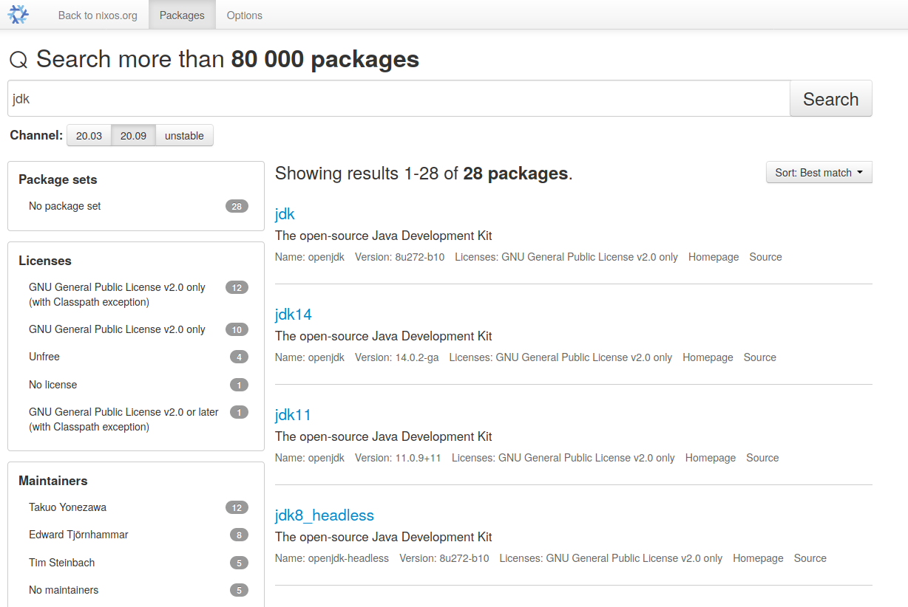

## NixOS 
> "Reproducible builds and deployments."

{ width=40% }

<small style="font-size: 9pt">
By Tim Cuthbertson CC BY 4.0, https://nixos.org
</small>


## Content 
:::::::::::::: columns
::: {.column width="50%"}
{ width=60% }

:::
::: {.column width="50%"}
**Nix**

* OS
* Package Manager
* Language
:::
::::::::::::::


::: notes
manager installable on windows, mac, linux
several copies of app in different versions
deployable like Ansible, Terraform
about as many packages as Arch Linux AUR

Nix lang = Json + functions
reproducible development environments =>faster onboarding
switching between projects is easy, effortless, fast
containerizsable into docker
:::

## Nix Package Manager

* Adhoc environments
  ```nix
  $ nix shell nixpkgs#python311 nixpkgs#poetry
  ```
* Reproducible environments
  ```nix
  mkDerivation {
    name = "myProject-1.0.0";
    src = ./src; 
    buildInputs = [ python311 poetry ...];
  }
  ```

::: notes
* \>60k packages
* many ecosystems\
Java, JS, Python, Rust, Haskell...
* reproducible
:::

## Demo
::: notes
Demo show nix shell 
nix-shell --packages cowsay --run "cowsay hi"
- jupyter notebook env
nix-shell --packages 'python3.withPackages(ps: with ps; [ numpy scipy matplotlib notebook scikitlearn scipy nltk spacy])'
- Find Nix Store Path of app
readlink -f $(which java)
:::

## Nix Language
**Derivation**
```nix
{
  "/nix/store/dvmidxj5...-myProject-1.0.0.drv": {
    "inputSrcs": [
      "/nix/store/9krlzvn...-default-builder.sh"
    ],
    "inputDrvs": {
      "/nix/store/1psqjc0l1..-bash-4.4-p23.drv": [
        "out"
      ],
      "/nix/store/8fbvqyxl9y...-myProject-1.0.0.tar.gz.drv": [
        "out"
      ],
      "/nix/store/m15naxf2...-stdenv-linux.drv": [
      ...
```

## Nix Language
:::::::::::::: columns
::: {.column width="50%"}

**≈Json + Functions**

```nix
mkDerivation {
  name = "myProject-1.0.0";
  src = ./src; 
  buildInputs = [ python311 poetry ...];
}
```
:::
::: {.column width="50%"}
**Benefits**

* Functional
* Pure (almost)
* Declarative


:::
::::::::::::::

## Nix Language

* Numbers `42`{.nix}
* Strings `"hello"`{.nix}
* List    `[1 2 3]`{.nix}
* Expressions `1+2+3`{.nix}

* Attribute Sets `{ key = value; ... }`{.nix}
* Let Bindings `let x = ... in ...`{.nix}
* Functions `f x`{.nix}

::: notes
pure = no side effects, no variables = declarative
functional = first-class support 
lazy = expression is not evaluated until value is needed
* Let-Expressions
* Pattern-Matching
not-general purpose language
dynamically types = no type signatures/compile time
:::

## Attribute Set
```nix
{
  name        = "myProject-1.0.0";
  src         = ./src; 
  buildInputs = [ python311 poetry ...];
  ...
}
```

```nix
{
  myNumber   = 3;
  myAttrSet  = { name = "myProject-1.0.0"; src = ... };
  myString   = otherAttrSet.nestedSet.name;
  myFunction = x: 2*x;
}
```

::: notes
adhoc variable declaration
think like const myDerivation
:::

## Let-Binding
Factor out common expression:

:::::::::::::: columns
::: {.column width="50%"}

```nix
{
  name        = otherAttrSet.a.b.c.d;
  src         = otherAttrSet.a.b.c.e; 
  ...
}
```

:::
::: {.column width="50%"}

```nix
let common = otherAttrSet.a.b.c;
in
  {
    name        = common.d;
    src         = common.e; 
    ...
  }
```

:::
::::::::::::::

::: notes
Plain assignment is not an expression, so not supported on its own, just as let...
:::

## Functions
:::::::::::::: columns
::: {.column width="50%"}

**Typescript**
```typescript
const f = x => 2x
f(3)
```

:::
::: {.column width="50%"}
**Nix**
```nix
f = x: 2*x        # definition
f 3               # usage
```

:::
::::::::::::::

::: notes
**Math**
```
f: ℝ ⟶ ℝ
f: x ↦ 2x
```
:::

## Functions
:::::::::::::: columns
::: {.column width="50%"}

**Typescript**
```typescript
const g = (x,y) => x+y
g(3,4)
```

:::
::: {.column width="50%"}
**Nix**
```nix
g = x: y: x+y
g 3 4
```

:::
::::::::::::::

## Functions
**Currying**
```
g: (ℝ,ℝ) ⟶ ℝ                      g: ℝ ⟶ (ℝ ⟶ ℝ)
g: (x,y) ↦ x+y                    g: x ↦ (y ↦ x+y)
```
**Usage**
```
g (3,4)                           g 3 4
                                ((g 3) 4)
```

## Functions
```nix
# Definition
mkDerivation = overrideAttrs: ...

# Usage
mkDerivation {
  name = "myProject-1.0.0";
  src = ./src; 
}
```

**Resulting Derivation**
```nix
{
  "/nix/store/dvmidxj5...-myProject-1.0.0.drv": {
    "inputSrcs": [
      "/nix/store/9krlzvn...-default-builder.sh"
    ],
    ...
```

::: notes
nix derivation show nixpkgs#hello
functions allow shorter code (code reuse) and strong customization
:::

## Derivation
```nix
let 
 pkgs = ...
in
pkgs.stdenv.mkDerivation {
  name = "myProject-1.0.0";
  src = ./src; 
  buildInputs = [ pkgs.python311 pkgs.poetry ];
  buildPhase = "poetry build";
}
```

::: notes
:::

## Nixpkgs
Just a huge attribute set:
```nix
# pkgs =
{
  stdenv = { mkDerivation = .. ; ... }
  ...
  poetry = stdenv.mkDerivation {... python311 ...}
  python39 = ..
  python311 = ..
  ...
  git = ....
  ...
  firefox = ...
  ...
}
```

<small style="font-size: 9pt">
https://github.com/NixOS/nixpkgs
</small>

::: notes
huge package set
ca 1.5GB
quite fast because lazy and mkDerivation functions aren't called if not used
:::

## Search Packages
{ width=70% }
https://search.nixos.org


## Reproducible Builds
```nix
$ nix build <derivation> # build artifact, put into store
```
**Store**
```bash
/nix/store/9234jfkdfj23j45r2102jfd-myProject-1.0.0
/nix/store/34234sdfjskdfj32j4kjdsf-python311-3.11.0
..
/nix/store/fsdkf234jdfdsfjkj0111df-poetry-1.6.1
/nix/store/sdf34dfkjlkj09u123123ss-poetry-1.6.1
..
```
```nix
$ nix develop flake.nix    # load environment with buildInputs
```

## Demo
::: notes
demo switching between two environments
- Find Nix Store Path of app
readlink -f $(which java)
docker https://nixos.org/guides/building-and-running-docker-images.html
:::

## NixOS
```nix

{
  boot.kernelPackages = pkgs.linuxPackages_6_5; 
  users.users.mneuss = { home = "/home/mneuss"; ...};

  environment.systemPackages = with pkgs; [
    jetbrains.idea-ultimate
    python311
  ];

  services.xserver.desktopManager.gnome3.enable = true;
  networking.firewall.allowedTCPPorts = [ 80 ];
  ...
}
```

```
nixos-rebuild switch ...
```

::: notes
**Declarative Linux operating system**
atomic new generation installation
atomic rollback
:::

## Further Study

{ width=10% }

:::::::::::::: columns
::: {.column width="50%"}
* **Main Page** https://nixos.org/
* **Nix packages** https://github.com/NixOS/nixpkgs
:::
::: {.column width="50%"}

* **My Blog** https://lambdablob.com/
* **Switch Dev Environments** https://direnv.net/

:::
::::::::::::::


::: notes
used by Mozilla for Firefox, Target, Atlassian for Marketplace, Klarna
:::
